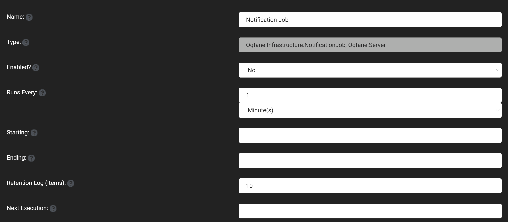

# Scheduled Jobs

The Schedule page enables you to manage what is essentially recurring, scheduled batch processing for Oqtane.There are many instances where a host may want to set something up to automatically do some task like sending a notification to users and this can be accomplished with the use of this feature. The options that are available on this page are:

* Add Job: Adds a new job by filling out the fields of:
    * Name: Choose the jobs name.
    * Type: Specify the type by either using NotificationJob or by creating your own job method in the infrastructure.jobs class in the Oqtane server. You will need to specify the location of the job in the framework, Ex. (Oqtane.Infrastructure.NotificationJob, Oqtane.Server) with the job being a notification job from the infrastructure class, which is a class inside of the Oqtane.Server.
    * Enabled: A yes or no to say if you want the job to be active at this time or not.
    * Runs Every: Choose an amount of time that specifies how often the job will execute.
    * Starting: Enter a date for when you want the job to start.
    * Ending: Enter a date for when you want the job to end.
    * Retention Log: A number to specify the amount of logs that will be retained.  
    
* View Logs: Shows all of the logs generated by all of your jobs within their retentio log number.
* Refresh: This refreshes the page to get new logs that have been made while you have been on this page.

Below this these options is a list of all of the jobs that are currently set up to be executed, that have a few options:
* Edit: Has all of the same fields as adding a job plus a field for the next execution:
    * Next execution: Input a date that will be the next time the job will run after the stop button has been pushed.
* Delete: Deletes the job so that it will never execute again.
* Log: View the logs that this jobs has generated.
* Stop: Stops the job from executing anymore, until a next execution has been specified in the edit window.